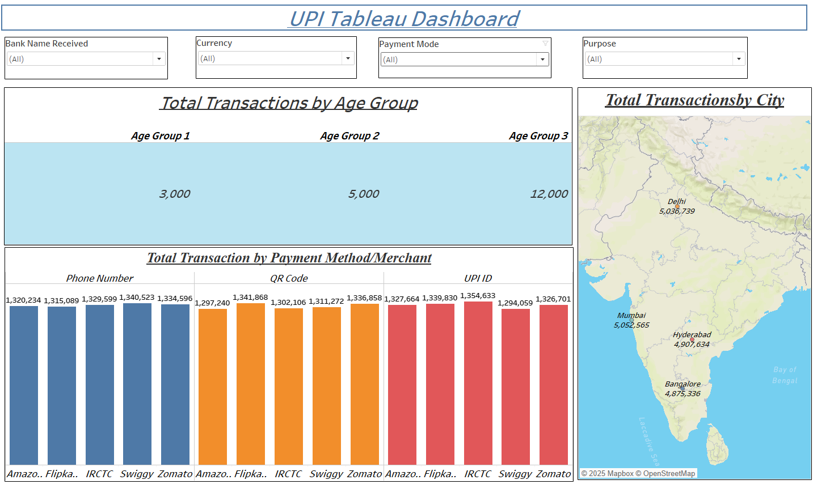

# 📊 UPI Tableau Dashboard

This Tableau dashboard provides a comprehensive visual overview of UPI (Unified Payments Interface) transactions segmented by multiple dimensions including **age group**, **city**, **payment method**, and **merchant**.

---

## 🔍 Dashboard Overview

### 1. **Total Transactions by Age Group**
Displays the distribution of UPI transactions across three defined age groups:
- **Age Group 1:** 3,000 transactions  
- **Age Group 2:** 5,000 transactions  
- **Age Group 3:** 12,000 transactions  

---

### 2. **Total Transactions by City**
A geo-spatial map visual showing transaction counts from major cities in India:
- **Mumbai:** 5,052,565  
- **Delhi:** 5,036,739  
- **Hyderabad:** 4,907,634  
- **Bangalore:** 4,875,336  

---

### 3. **Total Transactions by Payment Method / Merchant**
Bar charts categorized by UPI payment method:
- **Phone Number**
- **QR Code**
- **UPI ID**

Each method highlights transaction volumes from popular merchants such as:
- Amazon
- Flipkart
- IRCTC
- Swiggy
- Zomato

---

### 4. **Filters**
The dashboard includes the following dropdown filters for interactive exploration:
- **Bank Name Received**
- **Currency**
- **Payment Mode**
- **Purpose**

---

## 📁 File Information
- **File Name:** `image.png`
- **Tool Used:** Tableau
- **Visualization Type:** Interactive dashboard with bar charts, map views, and numeric KPIs

---

## 🧠 Insights & Use Cases
- Understand which age group contributes most to UPI transactions
- Identify high-transaction cities to focus regional marketing efforts
- Analyze merchant popularity and preferred payment methods
- Customize view using filters for targeted data exploration

---

## 📌 Requirements
To open and interact with this dashboard, you will need:
- Tableau Desktop or Tableau Public  
- Access to the UPI transaction dataset used for this visualization

---

